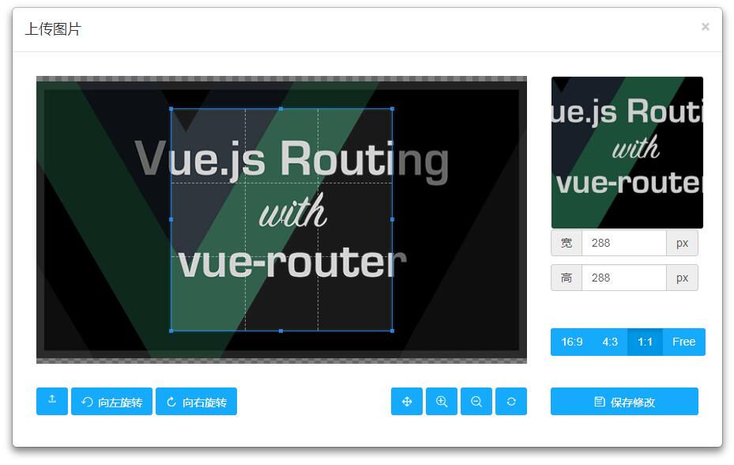

# 三镇网络科技有限公司

## 图片裁剪（Cropper）功能
>`jQuery`、`Bootstrap Modal`、`Cropper`

## How to use it
* 引入资源（直接引入）
``` html
 <script src="https://cdn.bootcss.com/jquery/1.12.4/jquery.js"></script>

 <link href="https://cdn.bootcss.com/bootstrap/3.3.6/css/bootstrap.min.css" rel="stylesheet" />
 <script src="https://cdn.bootcss.com/bootstrap/3.2.0/js/modal.min.js"></script>

 <link href="https://cdn.bootcss.com/cropper/2.3.4/cropper.min.css" rel="stylesheet" />
 <script src="https://cdn.bootcss.com/cropper/2.3.4/cropper.min.js"></script>
 <script src="https://cdn.bootcss.com/html2canvas/0.4.1/html2canvas.min.js"></script>
```

* 自定义样式及主函数（直接引入）
```html
<link href="css/customCropper.css" rel="stylesheet" />
<script src="js/customCropper.js"></script>
```

* HTML结构（直接引入）
 ```html
 <!-- 触发点击弹窗 -->
 <button type="button" class="btn customBlue"  data-toggle="modal" data-target="#avatar-modal" style="margin: 10px;">修改头像</button>

 <!-- 弹窗内容 - 开始 -->
<div class="modal fade" id="avatar-modal" aria-hidden="true" aria-labelledby="avatar-modal-label" role="dialog" tabindex="-1">
    <div class="modal-dialog modal-lg">
        <div class="modal-content">
            <!--<form class="avatar-form" action="upload-logo.php" enctype="multipart/form-data" method="post">-->
            <form class="avatar-form">
                <div class="modal-header">
                    <button class="close" data-dismiss="modal" type="button">&times;</button>
                    <h4 class="modal-title" id="avatar-modal-label">上传图片</h4>
                </div>
                <div class="modal-body">
                    <div class="avatar-body">
                        <div class="row">
                            <div class="col-md-9">
                                <div class="avatar-wrapper"></div>
                            </div>
                            <div class="col-md-3">
                              <div class="avatar-toggles">
                                <div class="avatar-preview preview-lg" id="imageHead"></div>
                                <!-- <div class="avatar-preview preview-md"></div>
                                <div class="avatar-preview preview-sm"></div> -->
                                <div class="input-group">
						            <label class="input-group-addon" for="dataWidth">宽</label>
						            <input type="text" class="form-control" id="dataWidth" placeholder="width">
						            <span class="input-group-addon">px</span>
						        </div>
						        <div class="input-group">
						        	<label class="input-group-addon" for="dataHeight">高</label>
						        	<input type="text" class="form-control" id="dataHeight" placeholder="height">
						            <span class="input-group-addon">px</span>
						        </div>
						        <div class="btn-group d-flex flex-nowrap" data-toggle="buttons">
						          <label class="btn customBlue"><input type="radio" class="sr-only" id="aspectRatio0" name="aspectRatio" value="1.7777777777777777">16:9</label>
						          <label class="btn customBlue"><input type="radio" class="sr-only" id="aspectRatio1" name="aspectRatio" value="1.3333333333333333">4:3</label>
						          <label class="btn customBlue"><input type="radio" class="sr-only" id="aspectRatio2" name="aspectRatio" value="1">1:1</label>
						          <label class="btn customBlue"><input type="radio" class="sr-only" id="aspectRatio4" name="aspectRatio" value="NaN">Free</label>
						        </div>
						      </div>
                            </div>
                        </div>
                        <div class="row avatar-btns docs-buttons">
                            <div class="col-md-4">
                            	<div class="btn-group">
                            	    <label class="btn customBlue icon-upload" for="inputImage" title="上专图片">
						                <input type="file" class="sr-only J_inputImage" id="inputImage" name="file" accept=".jpg,.jpeg,.png,.gif,.bmp,.tiff">
						            </label>
						        </div>
                                <div class="btn-group">
                                    <button class="btn customBlue icon-undo" data-method="rotate" data-option="-90" type="button"> 向左旋转</button>
                                </div>
                                <div class="btn-group">
                                    <button class="btn customBlue icon-repeat" data-method="rotate" data-option="90" type="button"> 向右旋转</button>
                                </div>
                            </div>
                            <div class="col-md-5" style="text-align: right;">
                                <button class="btn customBlue icon-arrows" data-method="setDragMode" data-option="move" type="button" title="移动"></button>
                                <button type="button" class="btn customBlue icon-search-plus" data-method="zoom" data-option="0.1" title="放大图片"></button>
                                <button type="button" class="btn customBlue icon-search-minus" data-method="zoom" data-option="-0.1" title="缩小图片"></button>
                                <button type="button" class="btn customBlue icon-refresh" data-method="reset" title="重置图片"></button>
                            </div>
                            <div class="col-md-3">
                                <button class="btn customBlue btn-block avatar-save icon-save" type="button" data-method="getCroppedCanvas"> 保存修改</button>
                            </div>
                        </div>
                    </div>
                </div>
            </form>
        </div>
    </div>
</div>
<!-- 弹窗内容 - 结束 -->
```

* 执行函数（根据业务需求，配置相关信息及回调函数即可）
```html
 <script type="text/javascript">

    function uploadCropper(){
    	// First: Get new cropper result.
    	var newPic = $('.avatar-save').attr('href');

    	// Do everything what you want to do.
    	// For Example:
    	 $('.avatar-form .close').trigger('click');
    	 $('body').append('');
    	 $('#pic').attr('src',newPic);

    }
</script>
```

## 资源网站
* Cropper插件：`https://github.com/fengyuanchen/cropper`
* UI参考：`http://www.sucaihuo.com/jquery/12/1289/demo/`

## UI设计


***

## 技术支持
* QQ：`1223930438`
* Email：`leiyong@infobigdata.com`
* GitHub：`https://github.com/ttflowerboys/fed-demo/tree/Cropper`
